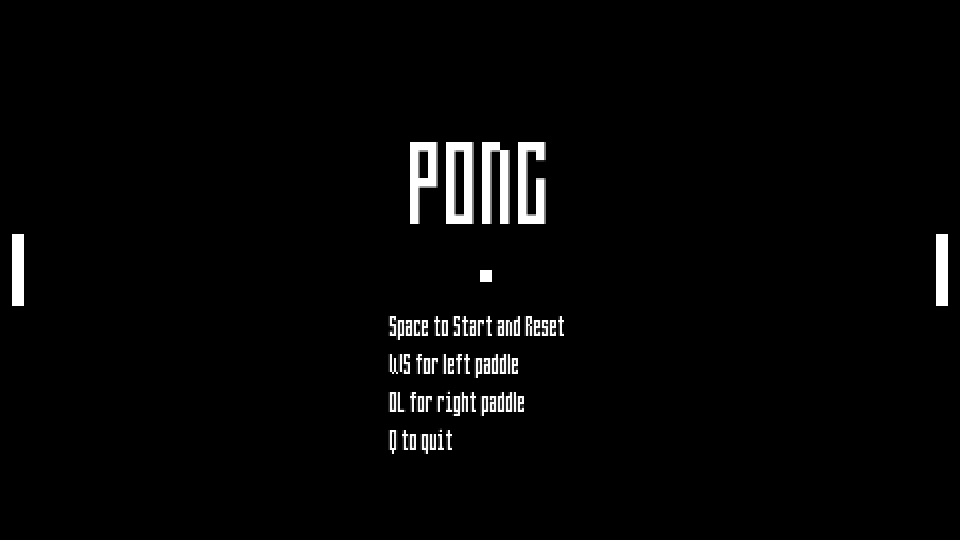
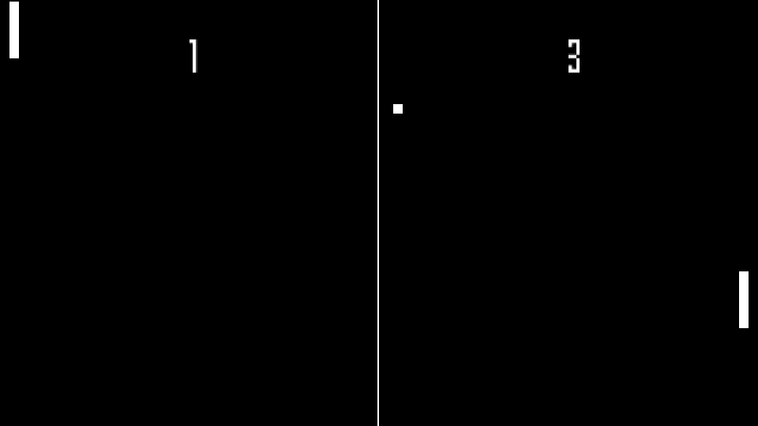
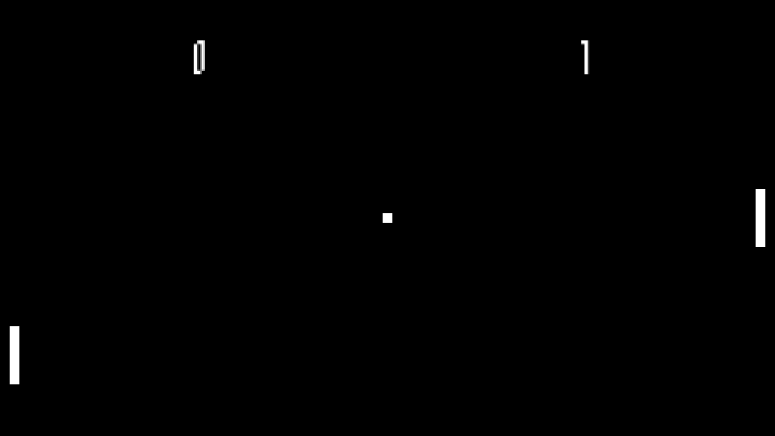

# PONG

The arcade classic finally comes to MACOS, simply download and compile to your machine to experience the epic thrills of the 1970s.

### Required Packages
- lsfml-graphics 
- lsfml-window 
- lsfml-system

### Compilation Instructions
Modify the LDFLAGS and CXXFLAGS in the included makefile point to wherever the above packages are installed on your machine, then run "make" to compile and run.

### Game Instructions
You and another player must try and hit the ball passed each other's paddles.

- WS to move left paddle up and down
- OL to move right paddle and down 
- Space to start a new round once a player has scored
- R to reset the game
- Q to quit

